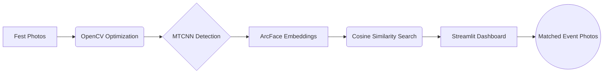

# 🎭 FaceFind: The Neural Event Photo Retrieval Engine


> **AI-Powered Facial Recognition System for Large-Scale Event Photography**


[](YOUR_LINK_HERE)


<p align="center">

  

</p>


<p align="center">

  <b>Because manually scrolling through 20GB of fest photos is primitive.</b>

</p>


<p align="center">

  

  

  

  

</p>


---


> [!IMPORTANT]

> **Motivation:** We built FaceFind because finding yourself in thousands of event photos shouldn't feel like searching for a needle in a digital haystack.


---


# 📖 Background & Motivation


Every college fest ends the same way:


* 📸 Thousands of DSLR photographs uploaded

* 💾 Massive folders consuming gigabytes of storage

* 🌑 Chaotic lighting conditions

* 👥 Crowd-heavy images everywhere


During **Culrav '25'**, our photography club released over:


* **2,000+ high-resolution images**

* Nearly **20GB of data**

* Thousands of random crowd shots


Finding personal photographs manually became exhausting.


So instead of scrolling endlessly through folders, I engineered a complete **AI-powered facial retrieval pipeline** capable of locating matching faces instantly.


---


# 🌩️ The Problem: "The Event Photo Chaos"


Modern college events generate an overwhelming amount of visual data.


> **The Reality:** Students spend more time searching for photos than actually enjoying them.


### Key Challenges


* Poor lighting & harsh shadows

* Tilted faces & motion blur

* Massive 4K DSLR image sizes

* Thousands of irrelevant frames

* CPU overload during processing


---


# 🔥 Performance: Before vs After Optimization


| Feature                   | Traditional Processing | FaceFind Optimized   |

| :------------------------ | :--------------------- | :------------------- |

| **Image Processing Time** | ⏳ ~48 Hours            | ⚡ ~80 Minutes        |

| **Memory Usage**          | 🔥 Extremely High      | ❄️ Optimized         |

| **Face Detection**        | 📉 Unstable            | 📈 Robust            |

| **Lighting Handling**     | 🌑 Weak                | 💎 Neural Adaptive   |

| **User Experience**       | 😵 Tedious             | 🚀 Instant Retrieval |


---


# ⚙️ Core Processing Status


`Image Indexing` ■■■■■■■■■■□□ 85%

`Face Detection` ■■■■■■■■■□□□ 78%

`Embedding Generation` ■■■■■■■■□□□□ 70%

`Similarity Search` ■■■■■■■■■■□□ 82%

`Result Retrieval` ■■■■■■■■■□□□ 80%


> [!TIP]

> FaceFind currently indexes thousands of high-resolution event images while maintaining optimized RAM consumption using OpenCV preprocessing.


<p align="center">

  

</p>


---


# ✨ The Solution: Neural Face Retrieval


**FaceFind** is not just a facial recognition script.


It is a complete **Neural Event Retrieval Engine** built to process massive event datasets efficiently.


---


## 🔄 The Workflow


### 1️⃣ Harvest


High-resolution event photos are collected from fest folders.


### 2️⃣ Optimize


Images are resized dynamically using OpenCV to reduce CPU & RAM load.


### 3️⃣ Detect


MTCNN identifies facial regions even under extreme lighting conditions.


### 4️⃣ Embed


ArcFace converts every face into a **512-dimensional neural embedding vector**.


### 5️⃣ Retrieve


Cosine Similarity computes vector distance between the uploaded selfie and indexed faces.


### 6️⃣ Display


Matched images are rendered inside a modern Streamlit interface.


---


# 🧠 Neural Architecture & Tech Stack


| Layer                | Technology          | Engineering Role             |

| :------------------- | :------------------ | :--------------------------- |

| **Image Processing** | `OpenCV`            | Dynamic Memory Optimization  |

| **Face Detection**   | `MTCNN`             | Multi-Stage Neural Detection |

| **AI Core**          | `ArcFace`           | Facial Embedding Generation  |

| **Vector Search**    | `Cosine Similarity` | Identity Matching            |

| **Backend Logic**    | `Python`            | Pipeline Orchestration       |

| **Frontend UI**      | `Streamlit`         | Interactive Visualization    |


---


# 🚀 The Optimization Breakthrough


## ⚡ The OpenCV Memory Hack


Directly processing DSLR images caused catastrophic CPU bottlenecks.


### ❌ Initial Benchmark


* Estimated runtime: **48+ Hours**


### ✅ Optimized Pipeline


* Final runtime: **~80 Minutes**


### 💡 Core Optimization


```python

cv2.resize(image, (1024, 1024))

```


Instead of pushing raw 4K DSLR images into neural models:


* Images were resized directly in RAM

* Memory usage dropped drastically

* Inference speed increased massively

* CPU utilization stabilized


---


# 📂 Project Structure


```bash

Facial_Extraction/

│

├── app.py

├── index_photos.ipynb

├── requirements.txt

├── README.md

│

├── Natyamanch/

├── Desi Sync/

└── Nukkad/

```


---


# 🛠️ Installation


## 1️⃣ Clone Repository


```bash

git clone https://github.com/amaanarif755/Facial_Extraction.git

cd Facial_Extraction

```


---


## 3️⃣ Add Event Images


Place event folders inside the root directory:


```bash

Facial_Extraction/

├── Natyamanch/

├── Desi Sync/

└── Nukkad/

```


---


## 4️⃣ Launch Streamlit


```bash

streamlit run app.py

```


---


# 📸 System Architecture





---


# 🧪 Future Roadmap


* [ ] FAISS Vector Database Integration

* [ ] GPU Acceleration

* [ ] Real-Time Face Indexing

* [ ] Cloud Deployment

* [ ] Multi-Face Clustering

* [ ] AI-Based Photo Ranking

* [ ] Mobile Application


---


## 🎥 Demo & Technical Breakdown


📌 LinkedIn architecture walkthrough here:


<p align="center">

  <a href="https://www.linkedin.com/feed/update/urn:li:activity:7434643197529690112/">

    

  </a>

</p>


---


# 👨‍💻 Creator


## Vansh Panwar


### B.Tech — MNNIT Allahabad


Machine Learning • Computer Vision • AI Systems


---


# ⭐ Support the Project


If you found this project interesting:


🌟 Star the repository

🍴 Fork the project

📢 Share it with your friends


---


<div align="center">


# 💀 “Finding your face in thousands of fest photos — powered by neural vision.”


</div>
